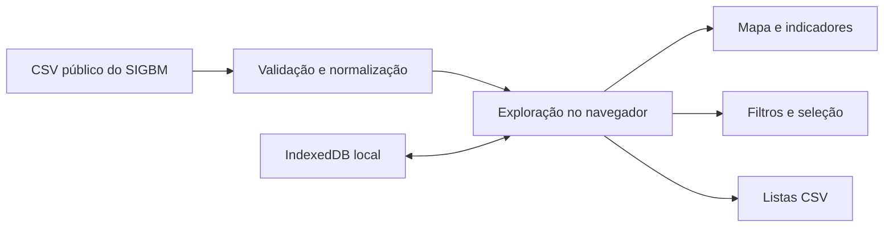

# SIGBM Market Intelligence

Aplicação web de inteligência de mercado construída sobre dados públicos do Sistema Integrado de Gestão de Barragens de Mineração (SIGBM), da Agência Nacional de Mineração.

O projeto transforma uma exportação cadastral extensa em uma superfície de análise: mapa nacional, filtros combinados, indicadores, inspeção de qualidade, seleção de estruturas e listas para qualificação. A unidade de análise é a **estrutura**, evitando assumir que uma relação comercial alcança automaticamente toda a empresa.

> Projeto independente e não oficial. Não possui vínculo institucional com a ANM e não substitui avaliações técnicas, regulatórias ou de segurança.

## Demonstração

[Abrir o painel publicado no GitHub Pages](https://provezanovsky.github.io/sigbm-market-intelligence/)

A aplicação é estática: os dados importados pelo usuário ficam somente no IndexedDB do navegador e não são enviados para servidores.

## Principais recursos

- mapa vetorial do Brasil com estruturas classificadas por situação operacional;
- busca por estrutura, empreendedor, documento e localização;
- filtros combinados por UF, município, minério, método construtivo, classificações e situação;
- intervalos de altura e volume com tratamento explícito para dimensões zeradas;
- seleção manual de estruturas para construção de listas;
- agrupamento cadastral de empreendedores por CNPJ completo ou, provisoriamente, por nome;
- exportação CSV do recorte, da seleção e dos empreendedores;
- carregamento local de novas exportações SIGBM;
- alertas de preenchimento e formato sem converter classificações técnicas em score comercial.

## Base demonstrativa

A fotografia inicial tem referência em **09/09/2026**:

| Indicador | Resultado |
|---|---:|
| Estruturas | 908 |
| Colunas originais | 24 |
| CNPJs identificados | 235 |
| UFs | 21 |
| Municípios/UF | 183 |
| Coordenadas mapeáveis | 902 |
| Coordenadas sinalizadas | 6 |

Os seis registros com coordenadas incompatíveis com o formato esperado permanecem disponíveis nas tabelas, mas não são posicionados por estimativa.

## Decisões de produto e dados

1. **Estrutura como unidade central:** o projeto ajuda a investigar operações e oportunidades em torno de cada estrutura.
2. **Ausência não vira zero:** valores ausentes, zerados e “N/A” são mantidos como estados distintos quando a fonte permite.
3. **Sem score artificial:** CRI, DPA, emergência e declarações não são tratados como propensão de compra.
4. **Rastreabilidade:** exportações incluem data da base, arquivo de origem, critérios do recorte e alertas de dados.
5. **Privacidade local:** novos CSVs são validados e armazenados apenas no navegador do usuário.

## Arquitetura



## Tecnologias

- Next.js e React;
- TypeScript;
- Leaflet e malhas do IBGE;
- TanStack Table;
- Recharts;
- IndexedDB;
- GitHub Actions e GitHub Pages.

## Executar localmente

Requisitos: Node.js 22 ou superior.

```bash
npm ci
npm run verify
npm run dev
```

Para gerar a versão estática:

```bash
npm run build
```

O resultado é criado em `out/`.

## Limitações conhecidas

- a base não identifica contratos, prestadoras, laboratórios, contatos, orçamento ou demanda por QA/QC;
- CNPJ oculto impede consolidação empresarial segura; nesses casos, o agrupamento por nome é apenas provisório;
- uma mesma organização pode possuir variações cadastrais;
- a categoria de descaracterização reúne projeto, obras e monitoramento no mesmo valor de origem;
- os indicadores representam a fotografia carregada, não uma consulta em tempo real.

## Fontes

- [SIGBM — versão pública](https://www.gov.br/anm/pt-br/assuntos/acesso-a-sistemas/sistema-integrado-de-gestao-de-barragens-de-mineracao-sigbm-versao-publica)
- [Dados abertos da ANM](https://www.gov.br/anm/pt-br/acesso-a-informacao/dados-abertos)
- [Bases de dados da ANM](https://www.gov.br/anm/pt-br/acesso-a-informacao/dados-abertos/bases-de-dados)
- [API de malhas territoriais do IBGE](https://servicodados.ibge.gov.br/api/docs/malhas?versao=3)

## Autoria

**Rafael Provezano** — concepção, diagnóstico de negócio, requisitos, análise dos dados e direção do produto.

Implementação desenvolvida com assistência do OpenAI Codex. A utilização de IA é documentada para manter transparência sobre o processo de construção.

## Licença

O código-fonte está disponível sob a [licença MIT](LICENSE). Os dados demonstrativos têm origem na ANM; a licença do código não reivindica propriedade sobre a base pública de terceiros.
